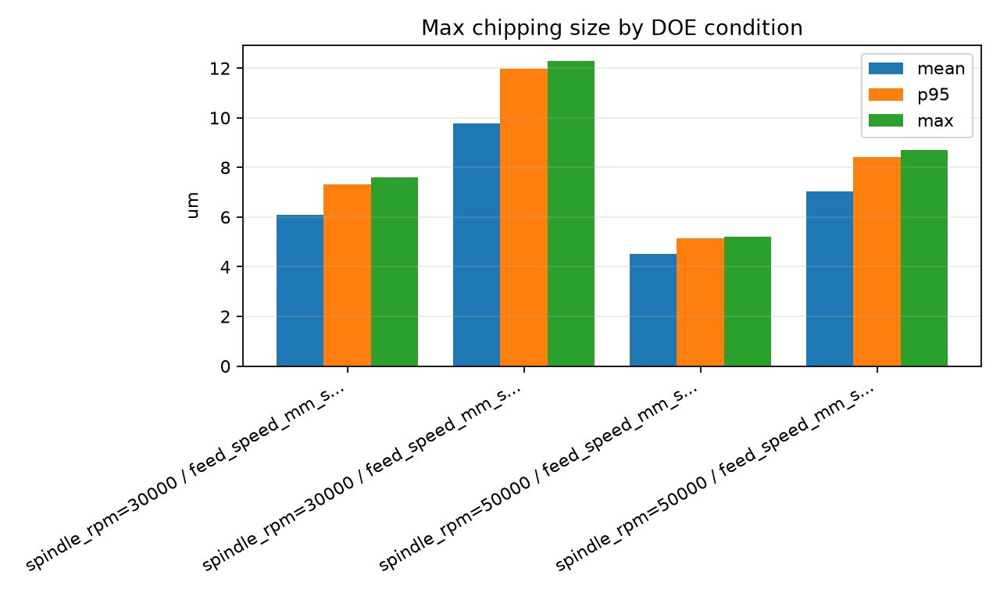

# Process DOE Planner

Process DOE Planner is a criteria-first, process-aware command-line engine for designing,
interpreting, and continuing DOE (Design of Experiments) workflows in process
optimization projects.

The current name reflects the implemented product: a deterministic DOE planning
engine. The **AI DOE Planner** name is reserved for a future version that adds
an LLM-based agent layer with tool calling and workflow orchestration.

> Status: executable alpha for portfolio and engineering review. The CLI
> generates candidate DOE plans and evidence reports; it does not authorize
> equipment recipes or production release.

It does not choose the next experiment from a p-value or a generic statistical
score alone. It first structures the project objective, response (`Y`) role,
spec direction, measurement confidence, production trade-off, and process
mechanism hypotheses. It then selects reproducible statistical evidence that
fits the current DOE stage and produces several defensible next-DOE options for
engineer review.

```text
Structured request + experiment data
-> validation/risk gate
-> stage-aware statistical tools
-> project-specific decision criteria
-> mechanism and production interpretation
-> ranked next-DOE options + evidence report
```

## See It in 60 Seconds

**Problem:** A small DOE dataset can show statistical differences without
answering the engineering question: which condition is acceptable, what risk
remains, and what experiment should be run next?

**Input:** A structured project request plus measured experiment results.

| Input | Example |
| --- | --- |
| Project context | wafer sawing, DISCO DAD 3241, quality-first productivity improvement |
| Factors (`X`) | spindle RPM and feed speed, with screening and practical follow-up ranges |
| Response (`Y`) | max chipping size, continuous and lower-is-better, USL 12 um |
| Engineering evidence | expected RPM/feed mechanisms, sampling plan, production objective |
| Measurements | repeated chipping measurements for each DOE condition |

**Output:** The CLI produces a reproducible evidence report, plots, and several
next-DOE choices. In the included demo it rejects `30,000 rpm / 150 mm/s`
because one measurement exceeds the specification, identifies feed speed as
the larger modeled effect, keeps residual/error visible in ANOVA, and offers
three follow-up paths: productivity refinement, best-condition confirmation,
and candidate-contrast confirmation.

- [Open the generated sample report](docs/demo/wafer_sawing/report.md)
- [Open the primary next-DOE table](docs/demo/wafer_sawing/next_doe.csv)
- [Inspect all generated demo artifacts](docs/demo/wafer_sawing/)



**Difference from generic statistical analysis:** statistics are evidence, not
the final decision rule. The planner regenerates its criteria and analysis
policy from the project objective, `Y` type, specification direction, DOE
stage, design structure, process mechanism, measurement confidence, and
production trade-off. It then exposes alternative next experiments instead of
presenting one opaque "optimal" answer.

## Analysis Policy

The same analysis recipe is not applied to every project. The engine builds an
analysis policy from five inputs:

1. Project objective and decision priority.
2. Response type: continuous, count, binary, categorical, or image-derived.
3. Spec profile: upper-only, lower-only, two-sided, or no hard spec.
4. DOE stage: screening, full factorial, trend refinement, confirmation, or capability.
5. Design structure: full factorial, fractional factorial, multilevel/custom, or confirmation.

Examples:

| Situation | Primary evidence |
| --- | --- |
| Upper-only quality Y | pass/fail, over-spec count/rate, max, p95, upper margin, Cpu when eligible |
| Lower-only strength Y | pass/fail, under-spec count/rate, min, p05, lower margin, Cpl when eligible |
| Full-factorial screening | main effects, estimable interactions, residual-inclusive ANOVA |
| Fractional screening | alias-aware main effects; no independent pairwise-interaction claims |
| Trend refinement | Pearson/Spearman, regression slope, ANOVA/Kruskal cross-check, boundary Welch test |
| Confirmation | repeatability, min/max/spread, confidence interval, capability eligibility |

Wafer-sawing max chipping is one upper-only example, not a hard-coded global
policy. A different process objective or Y type produces a different decision
profile and a different analysis suite.

## Executable MVP

The first programmatic MVP is now implemented as a command-line engine.

### Quick Start

```bash
git clone https://github.com/sujh0445/process-doe-planner.git
cd process-doe-planner
python -m venv .venv
source .venv/bin/activate
python -m pip install -e ".[dev]"

doe-planner validate --request examples/wafer_sawing/request.yaml
doe-planner report \
  --request examples/wafer_sawing/request.yaml \
  --data examples/wafer_sawing/results.csv \
  --out outputs/demo/report.md \
  --next-doe-out outputs/demo/next_doe.csv \
  --recommendations-out-dir outputs/demo/recommendation_options \
  --plots-out outputs/demo/plots
```

The legacy `ai-doe` command remains available as a compatibility alias.
Generated reports and plots are written under `outputs/`, which is intentionally
excluded from version control.

It converts:

```text
DOE request YAML + experiment result CSV/XLSX
-> statistical evidence
-> project-specific decision criteria evaluation
-> multi-mode next DOE recommendation
-> Markdown report
```

This is intentionally **criteria-first**, not statistics-first. The statistical
layer calculates evidence such as descriptive statistics, p95, spec margin,
capability indicators, main effects, interaction effects, and exploratory
ANOVA. The decision layer then interprets that evidence through the project
criteria: spec pass/fail, tail risk, process mechanism consistency,
measurement confidence, and production trade-off.

The report deliberately separates two statistical evidence layers:

- `Factor/effect evidence`: a modeled-effect ranking among selected main and
  interaction terms. This is useful for quick screening, but it does not include
  residual/error variation.
- `ANOVA evidence`: a residual/error-inclusive variance table for numeric Y
  types when the data supports it. Its contribution ratio is calculated from
  sum of squares including `Residual/Error`, so it is the correct place to read
  error-aware contribution.

Do not interpret modeled-effect weights as full ANOVA contribution. In small
DOE datasets, residual/error may include measurement variation, within-condition
sampling variation, unmodeled interaction, and ordinary random noise, so ANOVA
p-values and contribution ratios remain exploratory engineering evidence rather
than a production-release proof.

The next DOE stage is intentionally multi-mode. The engine keeps a primary
recommendation for CSV export, but the report also shows alternative next-step
options such as:

- `confirmation_doe`: repeat the current best condition to verify measurement
  stability and tail risk.
- `productivity_refinement_or_confirmation`: keep quality-critical factors
  fixed and refine the production factor.
- `quality_margin_confirmation`: choose the strongest quality-margin condition
  when production gain is less important than process safety.
- `candidate_contrast_confirmation`: compare top candidates when the decision
  is sensitive to trade-off or small-sample uncertainty.

This matches the project principle that the planner should not pretend there is
only one possible next DOE. It should expose the recommended path and the
defensible alternatives so an engineer can choose based on project priority.

Current runnable example:

```bash
cd process-doe-planner
python -m venv .venv
.venv/bin/pip install -e ".[dev]"

.venv/bin/doe-planner validate \
  --request examples/wafer_sawing/request.yaml

.venv/bin/doe-planner design \
  --request examples/wafer_sawing/request.yaml \
  --explain \
  --out outputs/mvp/wafer_sawing_design.csv

.venv/bin/doe-planner analyze \
  --request examples/wafer_sawing/request.yaml \
  --data examples/wafer_sawing/results.csv \
  --out outputs/mvp/wafer_sawing_report.md \
  --next-doe-out outputs/mvp/wafer_sawing_next_doe.csv \
  --plots-out outputs/mvp/plots

.venv/bin/doe-planner recommend \
  --request examples/wafer_sawing/request.yaml \
  --data examples/wafer_sawing/results.csv \
  --primary-out outputs/mvp/wafer_sawing_next_doe.csv \
  --out-dir outputs/mvp/recommendation_options

.venv/bin/doe-planner report \
  --request examples/wafer_sawing/request.yaml \
  --data examples/wafer_sawing/results.csv \
  --out outputs/mvp/wafer_sawing_report.md \
  --next-doe-out outputs/mvp/wafer_sawing_next_doe.csv \
  --recommendations-out-dir outputs/mvp/recommendation_options \
  --plots-out outputs/mvp/plots
```

Generalization example with a lower-spec continuous response and a categorical
failure-code guardrail:

```bash
.venv/bin/doe-planner report \
  --request examples/wire_bonding/request.yaml \
  --data examples/wire_bonding/results.csv \
  --out outputs/wire_bonding/report.md \
  --next-doe-out outputs/wire_bonding/next_doe.csv \
  --recommendations-out-dir outputs/wire_bonding/recommendation_options \
  --plots-out outputs/wire_bonding/plots
```

This example verifies that the planner changes its metrics and decision logic
for `Pull force` (lower-only continuous Y) and `Failure code` (categorical Y)
instead of reusing the wafer-sawing upper-tail policy.

Development mode without installing the package:

```bash
cd process-doe-planner

PYTHONPATH=src .venv/bin/python -m ai_doe_planner validate \
  --request examples/wafer_sawing/request.yaml

PYTHONPATH=src .venv/bin/python -m ai_doe_planner design \
  --request examples/wafer_sawing/request.yaml \
  --explain \
  --out outputs/mvp/wafer_sawing_design.csv

PYTHONPATH=src .venv/bin/python -m ai_doe_planner analyze \
  --request examples/wafer_sawing/request.yaml \
  --data examples/wafer_sawing/results.csv \
  --out outputs/mvp/wafer_sawing_report.md \
  --next-doe-out outputs/mvp/wafer_sawing_next_doe.csv \
  --plots-out outputs/mvp/plots

PYTHONPATH=src .venv/bin/python -m ai_doe_planner recommend \
  --request examples/wafer_sawing/request.yaml \
  --data examples/wafer_sawing/results.csv \
  --primary-out outputs/mvp/wafer_sawing_next_doe.csv \
  --out-dir outputs/mvp/recommendation_options

PYTHONPATH=src .venv/bin/python -m ai_doe_planner report \
  --request examples/wafer_sawing/request.yaml \
  --data examples/wafer_sawing/results.csv \
  --out outputs/mvp/wafer_sawing_report.md \
  --next-doe-out outputs/mvp/wafer_sawing_next_doe.csv \
  --recommendations-out-dir outputs/mvp/recommendation_options \
  --plots-out outputs/mvp/plots
```

No-test-dependency smoke check:

```bash
cd process-doe-planner
PYTHONPATH=src .venv/bin/python scripts/run_mvp_smoke.py
```

Input request templates:

- `templates/doe_request_template.yaml`: blank general-purpose starter request.
- `templates/process_requests/wafer_sawing_request.yaml`: wafer sawing starter.
- `templates/process_requests/die_attach_request.yaml`: epoxy die attach starter.
- `templates/process_requests/wire_bonding_2nd_request.yaml`: second-stitch wire bonding starter.
- `templates/process_requests/molding_transfer_request.yaml`: transfer molding starter.

The templates are copy-and-edit inputs for new DOE projects. They separate
machine capability, engineer-approved practical DOE range, and actual DOE
levels so the program does not treat equipment limits as safe experiment
conditions. The `design` command now uses `constraints.max_runs` as a practical
run-budget signal: if a full factorial design fits, it emits full factorial; if
a 4- or 5-factor two-level design exceeds the run budget but a half-fraction
fits, it emits a fractional screening table with an alias-structure note.
Use `doe-planner design --explain` to print the selected design type, rejected
alternative, run-budget rationale, and alias warnings alongside the generated
table. The `validate` command runs the same validation/risk gate before design
or analysis. `PASS` generates normally, `BLOCK` stops DOE generation, and `HOLD`
requires `doe-planner design --allow-hold` when the user intentionally wants a
review-marked draft despite missing review items.

Generated outputs:

- `outputs/mvp/wafer_sawing_design.csv`
- `outputs/mvp/wafer_sawing_report.md`
- `outputs/mvp/wafer_sawing_next_doe.csv` (primary recommendation only)
- `outputs/mvp/recommendation_options/*.csv` (all recommendation modes)
- `outputs/mvp/plots/*.png`

Main package modules:

- `src/ai_doe_planner/schemas.py`: structured request schema.
- `src/ai_doe_planner/risk_gate.py`: validation and risk-gate checks before analysis.
- `src/ai_doe_planner/statistics.py`: Python-based statistical evidence.
- `src/ai_doe_planner/criteria.py`: criteria-first condition evaluation.
- `src/ai_doe_planner/doe_generator.py`: DOE table generation and next DOE recommendation.
- `src/ai_doe_planner/reporter.py`: Markdown report generation.
- `src/ai_doe_planner/visualization.py`: reusable evidence plots for condition summary, effect ranking, and ANOVA contribution.
- `src/ai_doe_planner/cli.py`: command-line entrypoint.

Supported response types:

- `continuous`: size, force, thickness, warpage, sweep ratio, or other numeric Y.
- `image-derived`: numeric values extracted from images, such as chipping size or void ratio.
- `count`: defect count, over-spec count, fail count, or void count.
- `binary`: pass/fail, event/no-event, or converted risk flag.
- `categorical`: failure code, defect class, fracture mode, or operator classification.

The engine runs a validation/risk gate before analysis:

- `PASS`: request and data are sufficient for analysis.
- `HOLD`: analysis can continue, but an engineer should review missing specs, missing measurement methods, non-controllable factors, or weak mechanism evidence.
- `BLOCK`: analysis is stopped because required columns are missing, data is empty, or the response type is unsupported.

The validation report also exposes `blocking_reasons`, `review_reasons`,
`missing_fields`, `recommended_questions`, and `allowed_factor_space`, so the
planner can explain what must be fixed before a DOE matrix is trusted.

## Knowledge Sources And Public Scope

The reusable process interpretation is captured as reviewed Markdown knowledge
cards rather than bundling raw lecture files, recordings, or lab photographs.
Those raw materials remain local and are excluded by `.gitignore` because they
may contain private or licensed content.

The reviewed public documentation includes:

- Core contracts and decision logic under `docs/`, indexed by
  `docs/README.md`.
- Process knowledge cards:
  - `docs/knowledge/wafer-sawing-disco-d3241-card.md`: DISCO DAD3241 wafer
    sawing DOE knowledge card.
  - `docs/knowledge/die-attach-spa300-epoxy-card.md`: SPA-300 epoxy die attach
    DOE knowledge card.
  - `docs/knowledge/wire-bonding-2nd-bond-card.md`: second-stitch wire bonding
    DOE knowledge card.
  - `docs/knowledge/molding-substrate-frame-card.md`: transfer molding DOE
    knowledge card.
- `docs/statistics_ml_interpretation_guidelines.md`: shared statistics and
  data-analysis interpretation principles.

Local transcript reviews, source-material indexes, generated contact sheets,
and one-off conversion scripts remain available in the working folder but are
excluded from the public Git repository by an explicit allowlist.

## Product Direction

The first version should behave less like a generic chatbot and more like a
step-by-step DOE planning tool:

1. Define the engineering problem.
2. Choose the output variable, or `Y`.
3. Identify candidate input factors, or `X`.
4. Set factor levels.
5. Recommend a DOE type.
6. Generate an experiment table.
7. Accept result data.
8. Run or explain ANOVA-style interpretation.
9. Report main effects, interactions, and likely optimal conditions.

The MVP direction is now split into two layers:

1. A generic statistical analysis engine, initially validated with Spotfire or
   front-end process datasets.
2. Process-specific knowledge layers, starting with SNU front-end process
   materials and DISCO blade saw wafer sawing materials.

## Engine Architecture

Process DOE Planner should be built as a general DOE planning engine plus
context-specific profiles.

```text
Process DOE Planner Core
-> Y role definition
-> X candidate scoring
-> DOE purpose selection
-> DOE design recommendation
-> run table generation
-> effect/ANOVA-style interpretation
-> confirmation or next-DOE recommendation

Context Profile
-> time budget
-> operator maturity
-> equipment/process constraints
-> measurement availability
-> acceptable risk level
-> domain-specific guardrails
```

The 7-hour semiconductor training lab is one context profile, not the whole
product. Other profiles can support process optimization, manufacturing
quality improvement, R&D optimization, material mixture experiments, or
general screening.

## Engine Governance

The planner should treat DOE recommendation as a structured engineering
decision, not as a generic statistical answer.

Core operating rules:

- Define `Y` roles before selecting `X` factors.
- Separate hard constraints, quality objectives, guardrails, production
  objectives, and monitor variables.
- Select or create a `context_profile` before recommending a DOE table.
- Prefer focused 2- or 3-factor DOE when process knowledge already identifies
  likely dominant factors.
- Under the `semiconductor_training_lab_7h` profile, prefer a completed
  2-factor DOE with baseline/center/repeat evidence over an unfinished broader
  screening design.
- Use broader screening only when factor ranking is genuinely uncertain.
- Protect important interactions; a smaller full factorial can be better than
  a wider aliased screening design when the decision depends on an interaction.
- For fractional factorial or Plackett-Burman recommendations, show aliasing
  risk, expected resolution, interpretable effects, and follow-up requirements.
- Add or justify center points, replication, randomization, and blocking
  controls before treating a DOE table as execution-ready.
- Treat ANOVA, p-values, and scores as evidence, not final proof.
- Interpret results with effect size, main effects, interactions, robustness,
  and execution reliability, not p-values alone.
- Require confirmation or repeatability evidence before calling a condition an
  optimum.
- Label recommended conditions as candidate, provisional baseline, confirmed
  baseline, or production candidate rather than jumping to final optimum.
- Include a claim boundary in reports: what was found, what can be claimed,
  and what remains uncertain.
- Explain rejected DOE alternatives and recommendation confidence.
- Treat numeric DOE scores as internal decision scores, not success
  probabilities.
- Convert Risk AI Engine monitoring signals into DOE follow-up candidates only
  after checking data quality, mechanism, controllability, safe range, response,
  and guardrail linkage.
- Label evidence level explicitly: current DOE summaries are not final process
  proof until confirmation or repeated experimental evidence supports them.
- Translate predictive signals from Risk AI Engine into controllable factor
  hypotheses only after checking mechanism, controllability, safe range, and
  response/guardrail linkage.

These rules should be reflected in the scoring engine, DOE decision algorithm,
and future report-generation outputs.

## Current Boundaries

- The CLI recommends candidate experiments; it does not approve production release.
- Capability indices are formal only when sample size, stability, and measurement conditions are sufficient.
- Small-DOE p-values and effect rankings are engineering evidence, not causal proof.
- Process mechanism notes and safe operating ranges require engineer review.
- Raw training materials and real production data are not part of the public repository.

## Roadmap

1. Complete the wafer-sawing end-to-end reference workflow.
2. Add verified reference cases for die attach, wire bonding, and transfer molding.
3. Stabilize the public request schema and machine-readable report contract.
4. Add a UI after the CLI behavior and tests are stable.
