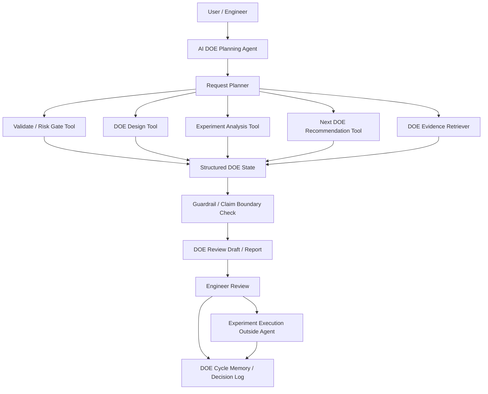

# AI DOE Planning Agent Design

작성일: 2026-08-06

## 1. Purpose

AI DOE Planning Agent는 AI DOE Planner의 deterministic DOE engine을 대체하지
않고, 기존 validation, risk gate, statistical evidence, criteria-first decision,
next DOE recommendation 기능을 tool로 호출해 engineer review 가능한 DOE 판단
초안을 만드는 workflow agent이다.

핵심 방향은 다음과 같다.

> AI DOE Planning Agent는 실험 조건을 최종 확정하거나 장비 조건을 직접 실행하는
> agent가 아니라, 검증된 DOE 분석 tool과 공정 근거를 연결해 다음 실험 후보와
> claim boundary를 작성하는 DOE 의사결정 보조 agent다.

이 문서는 현재 AI DOE Planner core를 변경하는 구현 계획이 아니라, 이후 agent화
논의를 위한 설계 초안이다.

## 2. Position In The Project

현재 AI DOE Planner core는 다음 범위를 유지한다.

```text
DOE request YAML / JSON
+ experiment result CSV / XLSX
-> validation / risk gate
-> statistical evidence
-> project-specific criteria evaluation
-> multi-mode next DOE recommendation
-> Markdown report
```

AI DOE Planning Agent는 이 core 위에서 사용자의 요청을 해석하고, 적절한 tool을
호출하고, 필요한 근거를 검색하고, 결과를 review 가능한 형태로 정리한다.

```text
user / engineer request
-> request clarification
-> validation and risk gate
-> design / analyze / recommend tool execution
-> evidence retrieval
-> DOE review draft
-> engineer approval / revision
-> DOE cycle logging
```

따라서 agent는 통계 계산, spec 판정, PASS/HOLD/BLOCK 판단을 LLM 내부에서 직접
수행하지 않는다. 중요한 계산과 판정은 deterministic tool이 담당하고, LLM은 tool
선택, 결과 연결, 설명, claim boundary 작성에 집중한다.

## 3. Overall Architecture



## 4. Input Modes

The agent should distinguish request types before executing tools.

| Input mode | Required inputs | Main workflow |
|---|---|---|
| Design-only | DOE request | Validate request -> generate design table |
| Analysis | DOE request + result data | Validate -> analyze responses -> criteria evaluation |
| Recommendation | DOE request + result data | Analyze -> recommend next DOE options |
| Report | DOE request + result data | Analyze -> visual evidence -> Markdown report |
| Risk-to-DOE handoff | Risk signal payload | Convert signal to controllable DOE hypothesis before request generation |
| Follow-up review | prior DOE cycle + new result | Compare recommendation, result, and confirmation status |

## 5. Agent Responsibilities

| Responsibility | Description |
|---|---|
| Request interpretation | Determine whether the user wants design, analysis, recommendation, report, or follow-up review. |
| Missing-information handling | Ask for missing process area, equipment, Y definition, measurement method, spec, or run budget. |
| Tool orchestration | Call validation, design, analysis, recommendation, report, and evidence retrieval tools in the correct order. |
| Risk gate routing | Enforce PASS/HOLD/BLOCK state transitions before proceeding. |
| Evidence retrieval | Retrieve process card, equipment card, measurement SOP, prior DOE, FMEA, or manual/spec evidence. |
| Criteria-first explanation | Explain results through hard constraints, quality objectives, guardrails, production objectives, and monitor variables. |
| Next DOE review draft | Convert next DOE options into engineer-readable recommendation, alternatives, and claim boundary. |
| Decision logging | Store recommendation, engineer decision, actual result, confirmation status, and rejected alternatives. |
| Risk AI handoff handling | Accept Risk AI signals only as DOE hypothesis candidates after controllability and measurement checks. |

## 6. Non-Responsibilities

The agent must not perform the following actions.

| Prohibited behavior | Reason |
|---|---|
| Call a condition the final optimum before confirmation | Small DOE evidence is not production proof. |
| Override spec or hard guardrails because an average value looks good | Hard constraints and guardrails must pass first. |
| Treat ANOVA, p-value, or effect ranking as causal proof | DOE evidence can be exploratory, aliased, or underpowered. |
| Generate DOE when risk gate is BLOCK | Required input or supported response structure is missing. |
| Treat HOLD as clean PASS | HOLD requires review-marked output and human review. |
| Execute equipment settings or process actions | Actual experiment execution requires engineer authority. |
| Let RAG evidence override rule/gate decisions | RAG is supporting evidence, not a higher-priority instruction. |
| Convert Risk AI signal directly into DOE factors | Mechanism, controllability, safe range, Y, and guardrail must be checked first. |

## 7. Candidate Tool Interface

These tools can be exposed later through MCP or a local agent tool registry.

| Tool | Role |
|---|---|
| `load_request` | Load and parse DOE request YAML/JSON. |
| `load_experiment_data` | Load CSV/XLSX experiment result data. |
| `validate_request` / `run_risk_gate` | Run PASS/HOLD/BLOCK validation and review-question generation. |
| `generate_design` | Generate DOE design table from approved factors and constraints. |
| `describe_design_plan` | Explain selected design type, rejected alternatives, run budget, and alias warnings. |
| `analyze_experiment` | Run data loading, risk gate, response analysis, criteria evaluation, and next DOE option generation. |
| `evaluate_conditions` | Apply criteria-first condition evaluation. |
| `recommend_next_doe_options` | Generate multi-mode next DOE options. |
| `write_visualizations` | Write evidence plots for report support. |
| `render_report` | Generate Markdown report from structured analysis result. |
| `retrieve_doe_evidence` | Retrieve process, equipment, measurement, prior DOE, or manual/spec evidence. |
| `log_doe_decision` | Store recommendation, engineer decision, result, and confirmation memory. |

## 8. RAG Evidence Candidates

Initial retrieval should start with local tag/keyword retrieval before vector DB.

Candidate evidence sources:

- process card
- equipment card
- measurement SOP
- FMEA / control plan notes
- lecture or transcript note
- prior DOE / run report
- manual / spec
- engineer comment
- photo evidence index
- report template and claim-boundary guideline

Recommended retrieval tags:

```text
process_area
equipment
factor
response_y
failure_mode
measurement_method
spec
guardrail
prior_condition
recommendation_mode
```

RAG output should answer:

- What process mechanism or prior evidence is relevant?
- Which factor or response does it support?
- What evidence is missing?
- Does the evidence support a design decision, interpretation, or only a caution?
- Does this evidence change the claim boundary?

## 9. DOE Cycle Memory Schema

The agent should store DOE decisions as structured memory, not only as Markdown
report text.

```json
{
  "cycle_id": "doe-cycle-2026-08-06-001",
  "project_name": null,
  "process_area": null,
  "equipment": null,
  "request_path": null,
  "result_data_path": null,
  "risk_gate_state": "PASS / HOLD / BLOCK",
  "risk_gate_reasons": [],
  "retrieved_evidence_ids": [],
  "recommendation_mode": "confirmation_doe",
  "recommended_condition": {},
  "alternative_options": [],
  "rejected_alternatives": [],
  "claim_boundary": "candidate condition, confirmation required",
  "human_review_required": true,
  "engineer_decision": "approved / revised / rejected / follow_up",
  "decision_reason": null,
  "actual_experiment_result_path": null,
  "confirmation_status": "not_run / pass / fail / inconclusive",
  "next_action": "confirm / refine / redesign / stop",
  "logged_at": "YYYY-MM-DD"
}
```

Minimum memory fields for the first MVP:

| Field | Why it matters |
|---|---|
| `cycle_id` | Traceability |
| `risk_gate_state` | Reconstruct whether the agent was allowed to proceed |
| `recommendation_mode` | Preserve why confirmation/refinement/redesign was selected |
| `recommended_condition` | Compare recommendation with actual experiment result |
| `claim_boundary` | Prevent later overclaiming |
| `engineer_decision` | Learn whether the recommendation was accepted |
| `confirmation_status` | Separate candidate from confirmed baseline |
| `next_action` | Connect one DOE cycle to the next |

## 10. LangGraph Workflow Candidate

```text
START
-> classify_request_mode
-> load_or_request_missing_inputs
-> run_validation_risk_gate
-> route_by_gate_state
   -> BLOCK: stop_and_return_required_questions
   -> HOLD: continue_only_as_review_marked_draft
   -> PASS: continue
-> select_workflow_branch
   -> design_only: generate_design_and_explain
   -> analysis: analyze_experiment
   -> recommendation: analyze_and_recommend_next_doe
   -> report: analyze_visualize_and_render_report
   -> risk_to_doe: validate_risk_signal_as_doe_hypothesis
-> retrieve_related_evidence
-> apply_claim_boundary_check
-> draft_engineer_review_output
-> human_review
   -> approved: log_approval
   -> revised: log_revision
   -> rejected: log_rejection_reason
   -> need_more_data: request_additional_measurement_or_confirmation
-> update_doe_cycle_memory
-> END
```

State transition rules:

| State | Next action |
|---|---|
| missing request | Ask for structured DOE request |
| missing data for analysis | Stop or switch to design-only mode |
| BLOCK | Stop and return blocking reasons plus required questions |
| HOLD | Allow review-marked draft only; require engineer review |
| PASS | Continue to selected tool branch |
| no hard spec for quality Y | HOLD until decision rule is defined |
| weak measurement method | HOLD or recommend measurement review / confirmation |
| critical guardrail failure | Do not optimize further; recommend guardrail stabilization |
| evidence gap high | Add unknown-context warning and conservative next DOE |
| human approval missing | Do not treat condition as execution-ready |

## 11. Output Template

The agent's DOE review note should be structured and conservative.

```markdown
# DOE Review Note

## Request Summary
- project:
- process_area:
- equipment:
- objective:
- run_budget:

## Validation / Risk Gate
- state:
- blocking reasons:
- review reasons:
- recommended questions:

## Evidence Used
| Evidence ID | Source | Used For | Limitation |
|---|---|---|---|

## Analysis Summary
- primary quality Y:
- guardrail Y:
- production objective:
- weakest margin or bottleneck:

## Next DOE Recommendation
- mode:
- recommended condition / design:
- rationale:
- alternatives considered:
- rejected alternatives:

## Claim Boundary
- candidate / provisional baseline / confirmed baseline / production candidate:
- what can be claimed:
- what remains uncertain:

## Required Human Decision
- approve / revise / reject / request more data
```

## 12. Guardrails

The first implementation should include explicit validation, output, and
permission guardrails.

| Guardrail | Policy |
|---|---|
| Risk gate guardrail | BLOCK stops generation; HOLD requires review-marked output. |
| Hard-constraint guardrail | Spec or critical failure mode failure blocks recommendation. |
| Measurement guardrail | Weak measurement confidence requires confirmation or measurement review. |
| Claim-boundary guardrail | Do not call a candidate an optimum without confirmation. |
| Causal guardrail | Do not state root cause from ANOVA/effect ranking alone. |
| RAG guardrail | Retrieved evidence supports interpretation but does not override deterministic rules. |
| Permission guardrail | Do not execute equipment or recipe changes. |
| Audit guardrail | Log tool calls, evidence IDs, recommendation, decision, and result. |

Forbidden phrases unless separately validated:

```text
final optimum
root cause confirmed
production ready
safe to apply immediately
guaranteed improvement
success probability
ANOVA proves
```

Safer phrasing:

```text
candidate condition
confirmation required
current evidence suggests
engineer review required
process mechanism is plausible but not proven
guardrail status limits the claim
```

## 13. Relationship With Risk AI Review Agent

AI DOE Planning Agent should not directly interpret `risk_score` or high-alert
cases as causal proof. Risk AI Review Agent may hand off a bounded DOE follow-up
candidate only after checking score semantics, feature evidence, and review
constraints.

Correct handoff:

```text
Risk AI signal
-> feature / segment pattern
-> mechanism plausibility check
-> controllable factor check
-> safe range check
-> measurable Y / guardrail check
-> DOE follow-up candidate
-> AI DOE Planning Agent
```

Handoff payload candidate:

```json
{
  "source": "Risk AI Review Agent",
  "risk_signal": "...",
  "suspected_feature_or_segment": "...",
  "mechanism_hypothesis": "...",
  "controllable_factor_candidate": "...",
  "safe_range_evidence": "...",
  "measurable_response_candidate": "...",
  "guardrail_candidate": "...",
  "evidence_ids": [],
  "claim_boundary": "hypothesis for controlled DOE, not confirmed root cause"
}
```

AI DOE Planning Agent then converts this payload into a valid DOE request only if:

1. the factor is controllable,
2. the proposed range is safe,
3. a measurable response Y exists,
4. a hard spec or guardrail is defined,
5. the run budget supports the required design,
6. confirmation or engineer review is included.

## 14. Gaps And Improvement Plan

| Gap | Improvement direction | Priority |
|---|---|---|
| No implemented agent orchestrator | Start with read-only workflow wrapper over existing CLI/tools. | High |
| No implemented RAG retriever | Start with tag/keyword evidence retrieval over `docs/knowledge` and report docs. | High |
| Decision memory is mostly design-level | Add `doe_cycle_memory.json` or CSV. | High |
| No LLM output guardrail | Add forbidden-claim checker before final review note. | High |
| MCP tool interface not implemented | Expose existing CLI/core functions as tool registry. | Medium |
| Human review result is not structured | Add approval/revision/rejection schema. | Medium |
| Risk AI handoff gate is informal | Add `risk_signal_to_doe_hypothesis` validation step. | Medium |

## 15. Implementation Phases

### Phase 1: Read-Only DOE Review Agent MVP

- Load existing DOE request and result data.
- Run validation / risk gate.
- Run analysis and next DOE recommendation tools.
- Draft review note from structured outputs.
- Enforce claim-boundary and permission guardrails.
- Do not execute equipment actions.

### Phase 2: Evidence-Supported DOE Agent

- Add tag/keyword RAG over process cards, measurement notes, prior DOE reports,
  and manuals/specs.
- Attach evidence IDs to recommendations.
- Add unknown-context warning when evidence is missing or weak.
- Add standard engineer review note template.

### Phase 3: DOE Cycle Memory And Handoff

- Add DOE cycle memory for recommendation, decision, actual result, and
  confirmation status.
- Compare previous recommendations with actual outcomes.
- Accept bounded Risk AI Review Agent handoff payloads.
- Convert eligible risk signals into controlled DOE follow-up candidates.

## 16. Portfolio Positioning

> AI DOE Planning Agent는 AI DOE Planner의 deterministic validation, statistical
> analysis, criteria-first evaluation, next DOE recommendation 기능을 tool로
> 호출하고, RAG evidence, claim boundary, human review, DOE cycle memory를
> 결합해 다음 실험 후보를 제안하는 workflow agent로 설계한다. 이 agent는 최종
> 실험 조건이나 공정 조치를 자동 확정하지 않고, 검증 가능한 근거와 승인 절차를
> 통해 DOE 의사결정을 보조한다.

## 17. References

- `docs/validation-risk-gate-contract.md`
- `docs/doe-decision-algorithm.md`
- `docs/project-specific-decision-criteria.md`
- `docs/evidence-and-unknown-context-risk.md`
- `docs/artifact-logging-and-feedback-loop.md`
- `docs/llm_ai_system_reflection_candidates.md`
- `README.md`
