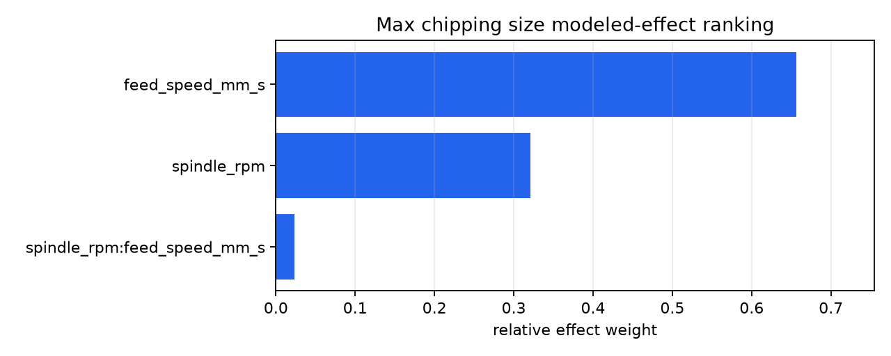
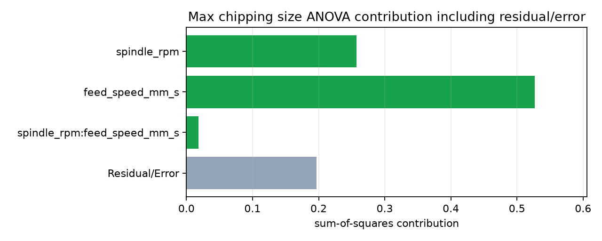

# Wafer sawing feed productivity MVP DOE Analysis Report

## 1. DOE Round Summary

- Process area: wafer_sawing
- Equipment: DISCO DAD 3241
- Primary goal: Increase feed speed while keeping chipping risk acceptable.
- Business goal: Reduce cutting time.
- Decision mode: quality-first productivity improvement

## 2. Validation and Risk Gate

- Gate state: PASS
- No validation or risk-gate findings.

## 3. X/Y Definition

| factor | name | unit | role | range/levels |
| --- | --- | --- | --- | --- |
| spindle_rpm | Spindle RPM | rpm | quality_factor | (30000, 50000) |
| feed_speed_mm_s | Feed speed | mm/s | productivity_factor | (50, 150) |

Factor level context:

| scope | factor | levels/range | purpose |
| --- | --- | --- | --- |
| initial screening | spindle_rpm | [30000, 50000] | first DOE contrast, not the full equipment limit |
| initial screening | feed_speed_mm_s | [50, 150] | first DOE contrast, not the full equipment limit |
| practical follow-up | spindle_rpm | (30000.0, 50000.0) | allowed search window after the first evidence review |
| practical follow-up | feed_speed_mm_s | (10.0, 200.0) | allowed search window after the first evidence review |
| observed follow-up | feed_speed_mm_s | [10, 200] | boundary or trend check used after screening |

| response | type | role | direction | spec |
| --- | --- | --- | --- | --- |
| max_chipping_size_um | continuous | primary_quality_y | lower_is_better | LSL=None, USL=12.0 |

Design generation logic:

| requested | selected | factor_count | full_runs | selected_runs | max_runs | rationale |
| --- | --- | --- | --- | --- | --- | --- |
| full_factorial | full_factorial | 2 | 4 | 4 | 4 | A full factorial design was explicitly requested. |

## 4. Y-Type and Analysis Method

Analysis is selected by response type and DOE purpose. The project criteria decide what matters first; statistics are used as reproducible evidence for those criteria. Condition-level evidence drives the decision, while round-level pooled statistics are optional diagnostic context because they mix different process settings.

### Max chipping size

- Selection basis: Y type `continuous`, spec `upper_only`, DOE stage `screening`, design `full_factorial`.
- Decision metrics: condition_mean, repeatability, confidence_interval, spec_pass_fail, over_spec_count_rate, max, p95, upper_margin, Cpu_if_eligible
- Interaction policy: `main_and_pairwise_interactions_when_estimable`
- Capability policy: `formal_only_when_n_ge_33_and_process_is_stable`
- Selected methods:
| method | reason |
| --- | --- |
| condition_level_summary | All decisions compare actual process conditions. |
| spec_and_tail_evidence | Y uses a upper_only decision boundary. |
| factor_effect_analysis | The current DOE stage is intended to compare factor directions and relative influence. |
| residual_inclusive_anova | Replicated condition data can separate modeled terms from residual/error variation. |

Project decision profile:

- These criteria come from the request file, process objective, Y type, specs, measurement method, and mechanism notes.
- Do not reuse these exact criteria for another DOE unless that project's objective and failure mode are the same.
- Statistics below are evidence for these criteria, not the criteria themselves.

| priority | decision_layer | criterion | role | metric | rule | next_doe_impact |
| --- | --- | --- | --- | --- | --- | --- |
| 1 | hard quality decision | Spec pass/fail | quality_gate | over-spec count and worst-case max | No sampled edge should exceed the upper spec. | If any over-spec occurs, move to safer feed/RPM region. |
| 2 | tail-risk guardrail | Tail risk | risk_guardrail | max and p95 by condition | Warning-zone measurements should be reviewed before aggressive productivity improvement. | If p95 or max rises sharply, confirm locally rather than increasing feed. |
| 3 | process mechanism check | Mechanism consistency | mechanism_consistency | effect direction versus sawing mechanism | RPM and feed effects should be interpreted against expected cutting-load and productivity mechanisms. | If the statistical effect conflicts with mechanism expectations, add confirmation before committing to a narrower window. |
| 4 | production trade-off | Productivity trade-off | production_objective | feed speed after quality gate | Higher feed is valuable only after chipping risk passes. | If high feed passes, refine or confirm the feed window. |
| 5 | measurement confidence | Measurement confidence | measurement_confidence | sample count, tail observation, manual high-scope reliability | Candidate conditions should be confirmed when sample count is small or worst-case risk drives the decision. | Use confirmation DOE or additional samples before final release when the selected condition is close to the guardrail. |

## 5. Condition-Level Response Analysis

### Max chipping size

Primary decision evidence by condition:
- Capability is shown as a reference only; it is a sample-size-gated capability reference unless the same condition has enough repeated, representative measurements and the process is stable.
| condition | n | mean | mean_ci95 | min | max | p05 | p95 | fail | fail_rate | warning | capability_ref | capability_status |
| --- | --- | --- | --- | --- | --- | --- | --- | --- | --- | --- | --- | --- |
| spindle_rpm=30000 / feed_speed_mm_s=50 | 10 | 6.1 | [5.474, 6.726] | 4.7 | 7.6 | 4.925 | 7.33 | 0 | 0 | 0 | 2.246 | exploratory_n_lt_33 |
| spindle_rpm=30000 / feed_speed_mm_s=150 | 10 | 9.77 | [8.725, 10.82] | 7.8 | 12.3 | 8.07 | 11.98 | 1 | 0.1 | 5 | 0.5086 | exploratory_n_lt_33 |
| spindle_rpm=50000 / feed_speed_mm_s=50 | 10 | 4.52 | [4.183, 4.857] | 3.8 | 5.2 | 3.89 | 5.155 | 0 | 0 | 0 | 5.294 | exploratory_n_lt_33 |
| spindle_rpm=50000 / feed_speed_mm_s=150 | 10 | 7.03 | [6.374, 7.686] | 5.6 | 8.7 | 5.825 | 8.43 | 0 | 0 | 0 | 1.807 | exploratory_n_lt_33 |

Round-level diagnostic summary:

- Omitted by project criteria. This DOE uses condition-level criteria as the decision basis.
- Set `constraints.include_pooled_diagnostics: true` only when a pooled round-level diagnostic is useful for the current project.

Factor/effect evidence (modeled effects only, error not included):
| term | kind | effect | relative_effect_weight | basis |
| --- | --- | --- | --- | --- |
| feed_speed_mm_s | main | 3.09 | 0.6562 | modeled_effects_only_no_error |
| spindle_rpm | main | -2.16 | 0.3207 | modeled_effects_only_no_error |
| spindle_rpm:feed_speed_mm_s | interaction | -0.58 | 0.02312 | modeled_effects_only_no_error |
- These weights rank modeled main/interaction effects only; use the ANOVA table below for residual/error-inclusive contribution.

ANOVA evidence (residual/error included):
| term | kind | scope | df | sum_sq | mean_sq | F | p_value | contribution |
| --- | --- | --- | --- | --- | --- | --- | --- | --- |
| spindle_rpm | main | main_plus_pairwise_interactions | 1 | 46.66 | 46.66 | 47.08 | 4.995e-08 | 0.2575 |
| feed_speed_mm_s | main | main_plus_pairwise_interactions | 1 | 95.48 | 95.48 | 96.34 | 1.019e-11 | 0.527 |
| spindle_rpm:feed_speed_mm_s | interaction | main_plus_pairwise_interactions | 1 | 3.364 | 3.364 | 3.394 | 0.07367 | 0.01857 |
| Residual/Error | error | main_plus_pairwise_interactions | 36 | 35.68 | 0.9911 | - | - | 0.1969 |
- Residual/Error captures within-condition, sampling, measurement, and unmodeled variation; small DOE p-values remain exploratory.

Visual evidence:

## 6. Decision Criteria Evaluation

Condition state is decided by explicit project criteria first: quality gate, tail risk, measurement confidence, mechanism consistency, then production trade-off inside the accepted quality window.

| condition | state | quality | tail_risk | measurement | mechanism | production | total | reason |
| --- | --- | --- | --- | --- | --- | --- | --- | --- |
| spindle_rpm=50000 / feed_speed_mm_s=50 | candidate | 94 | 97.38 | 100 | 100 | 0 | 86.31 | Max chipping size: worst-case margin 6.8 um; Max chipping size: p95/tail margin 6.84 um |
| spindle_rpm=30000 / feed_speed_mm_s=50 | candidate | 82 | 88.68 | 100 | 100 | 0 | 78.4 | Max chipping size: worst-case margin 4.4 um; Max chipping size: p95/tail margin 4.67 um |
| spindle_rpm=50000 / feed_speed_mm_s=150 | borderline | 76.5 | 84.28 | 100 | 100 | 100 | 84.72 | Max chipping size: worst-case margin 3.3 um; quality score 76.5 is below the strong-candidate margin threshold |
| spindle_rpm=30000 / feed_speed_mm_s=150 | rejected | 0 | 0 | 60 | 100 | 100 | 26 | Max chipping size: 1 over-spec measurement(s); Max chipping size: tail rejected by 1 over-spec point(s) |

Criterion-by-criterion evidence:

| condition | criterion | role | score | state | evidence |
| --- | --- | --- | --- | --- | --- |
| spindle_rpm=50000 / feed_speed_mm_s=50 | Spec pass/fail | quality_gate | 94 | pass | Max chipping size: worst-case margin 6.8 um |
| spindle_rpm=50000 / feed_speed_mm_s=50 | Tail risk | risk_guardrail | 97.38 | pass | Max chipping size: p95/tail margin 6.84 um |
| spindle_rpm=50000 / feed_speed_mm_s=50 | Measurement confidence | measurement_confidence | 100 | pass | Max chipping size: n=10/10 versus planned samples |
| spindle_rpm=50000 / feed_speed_mm_s=50 | Mechanism consistency | mechanism_consistency | 100 | pass | feed_speed_mm_s->Max chipping size: expected risk, observed risk; spindle_rpm->Max chipping size: expected improve, observed improve |
| spindle_rpm=50000 / feed_speed_mm_s=50 | Production trade-off | production_objective | 0 | secondary | Production score from feed_speed_mm_s |
| spindle_rpm=30000 / feed_speed_mm_s=50 | Spec pass/fail | quality_gate | 82 | pass | Max chipping size: worst-case margin 4.4 um |
| spindle_rpm=30000 / feed_speed_mm_s=50 | Tail risk | risk_guardrail | 88.68 | pass | Max chipping size: p95/tail margin 4.67 um |
| spindle_rpm=30000 / feed_speed_mm_s=50 | Measurement confidence | measurement_confidence | 100 | pass | Max chipping size: n=10/10 versus planned samples |
| spindle_rpm=30000 / feed_speed_mm_s=50 | Mechanism consistency | mechanism_consistency | 100 | pass | feed_speed_mm_s->Max chipping size: expected risk, observed risk; spindle_rpm->Max chipping size: expected improve, observed improve |
| spindle_rpm=30000 / feed_speed_mm_s=50 | Production trade-off | production_objective | 0 | secondary | Production score from feed_speed_mm_s |
| spindle_rpm=50000 / feed_speed_mm_s=150 | Spec pass/fail | quality_gate | 76.5 | borderline | Max chipping size: worst-case margin 3.3 um |
| spindle_rpm=50000 / feed_speed_mm_s=150 | Tail risk | risk_guardrail | 84.28 | pass | Max chipping size: p95/tail margin 3.57 um |
| spindle_rpm=50000 / feed_speed_mm_s=150 | Measurement confidence | measurement_confidence | 100 | pass | Max chipping size: n=10/10 versus planned samples |
| spindle_rpm=50000 / feed_speed_mm_s=150 | Mechanism consistency | mechanism_consistency | 100 | pass | feed_speed_mm_s->Max chipping size: expected risk, observed risk; spindle_rpm->Max chipping size: expected improve, observed improve |
| spindle_rpm=50000 / feed_speed_mm_s=150 | Production trade-off | production_objective | 100 | secondary | Production score from feed_speed_mm_s |
| spindle_rpm=30000 / feed_speed_mm_s=150 | Spec pass/fail | quality_gate | 0 | rejected | Max chipping size: 1 over-spec measurement(s) |
| spindle_rpm=30000 / feed_speed_mm_s=150 | Tail risk | risk_guardrail | 0 | rejected | Max chipping size: tail rejected by 1 over-spec point(s) |
| spindle_rpm=30000 / feed_speed_mm_s=150 | Measurement confidence | measurement_confidence | 60 | borderline | Max chipping size: n=10/10 versus planned samples, 1 over-spec point(s) require confirmation |
| spindle_rpm=30000 / feed_speed_mm_s=150 | Mechanism consistency | mechanism_consistency | 100 | pass | feed_speed_mm_s->Max chipping size: expected risk, observed risk; spindle_rpm->Max chipping size: expected improve, observed improve |
| spindle_rpm=30000 / feed_speed_mm_s=150 | Production trade-off | production_objective | 100 | secondary | Production score from feed_speed_mm_s |

## 7. Bottleneck Y Decision

- Bottleneck response: Max chipping size
- Fail count: 1
- Weakest margin: -0.3

## 8. Process and Production Interpretation

### Process mechanism evidence

- Mechanism hypothesis: Higher RPM should reduce chipping risk.
- Mechanism hypothesis: Higher feed speed should improve productivity but may increase chipping and tail risk.
- Mechanism hypothesis: Production benefit is considered only after the quality gate is passed.
- Mechanism hypothesis: The first screening DOE may use a narrower low/high contrast, then follow-up DOE can test boundary levels such as feed 10 or 200 mm/s when the evidence calls for it.

| response | factor | levels | effect | quality_direction | mechanism_note |
| --- | --- | --- | --- | --- | --- |
| Max chipping size | feed_speed_mm_s | 50 -> 150 mm/s | 3.09 | high level moves Y in the quality-risk direction | Higher feed speed improves throughput but can increase chipping risk. |
| Max chipping size | spindle_rpm | 30000 -> 50000 rpm | -2.16 | high level moves Y in the quality-improving direction | Higher RPM is expected to reduce chipping by lowering cutting load per abrasive interaction. |

Interaction check:

| response | interaction | effect | relative_effect_weight | interpretation |
| --- | --- | --- | --- | --- |
| Max chipping size | spindle_rpm:feed_speed_mm_s | -0.58 | 0.02312 | review before separating main-effect-only conclusions |
- Interaction evidence is used as a guardrail. Strong or mechanism-critical interactions should trigger confirmation or focused follow-up before broad optimization.

### Production interpretation

| item | interpretation | evidence |
| --- | --- | --- |
| production factor | feed_speed_mm_s | desired direction=higher_is_better, selected value=50 |
| selected condition | spindle_rpm=50000 / feed_speed_mm_s=50 | state=candidate, quality=94, tail=97.38, measurement=100, mechanism=100, production=0, total=86.31 |
| DOE steering rule | production is optimized only inside the quality/risk guardrail | candidate feed or throughput gains are rejected or held if tail risk, worst case, or spec margin is weak |

Level strategy note:

- Initial low/high levels are screening contrasts. Follow-up levels can move outside the first low/high pair when the decision criteria require boundary, productivity, or confirmation evidence.

## 9. Next DOE Recommendation

- Primary mode: productivity_refinement_or_confirmation
- Primary rationale: Best current condition passes quality criteria. Keep other factors fixed and refine feed_speed_mm_s to quantify the productivity trade-off without changing the full process window.

Recommendation options:

### Option 1. Productivity refinement or confirmation

- Mode: productivity_refinement_or_confirmation
- Priority: 1
- Rationale: Best current condition passes quality criteria. Keep other factors fixed and refine feed_speed_mm_s to quantify the productivity trade-off without changing the full process window.
- Decision basis:
  - Best condition state is candidate, so production refinement is allowed after quality screening.
  - feed_speed_mm_s is marked as the production trade-off factor.
  - Refinement stays inside the practical factor bounds 10.0 to 200.0.

| run | spindle_rpm | feed_speed_mm_s |
| --- | --- | --- |
| 1 | 50000 | 50 |
| 2 | 50000 | 55 |
| 3 | 50000 | 200 |

### Option 2. Best-condition confirmation

- Mode: confirmation_doe
- Priority: 2
- Rationale: Repeat the current best condition to confirm measurement stability, tail risk, and repeatability before treating it as a baseline or final candidate.
- Decision basis:
  - Current best condition is spindle_rpm=50000 / feed_speed_mm_s=50.
  - Confirmation is useful when sample size, measurement confidence, or tail risk is still limited.

| run | spindle_rpm | feed_speed_mm_s |
| --- | --- | --- |
| 1 | 50000 | 50 |

### Option 3. Candidate contrast confirmation

- Mode: candidate_contrast_confirmation
- Priority: 3
- Rationale: Compare the top candidate conditions under the same measurement plan when the decision is sensitive to a quality-production trade-off or small sample noise.
- Decision basis:
  - 3 candidate or borderline conditions remain close enough to compare.
  - Contrast testing separates a real process improvement from small-sample or measurement noise.
  - Use this when quality and production scores point to different preferred conditions.

| run | purpose | decision_state | quality_score | production_score | spindle_rpm | feed_speed_mm_s |
| --- | --- | --- | --- | --- | --- | --- |
| 1 | candidate_contrast | candidate | 94 | 0 | 50000 | 50 |
| 2 | candidate_contrast | candidate | 82 | 0 | 30000 | 50 |
| 3 | candidate_contrast | borderline | 76.5 | 100 | 50000 | 150 |

## 10. Remaining Risk

- This MVP report treats small-sample statistics as exploratory evidence.
- Capability indices are screening references when condition n is below 33 or sampling is not representative.
- Project criteria must be regenerated for each DOE objective; reuse the framework, not another project's thresholds.
- Measurement confidence, sampling method, and process transfer risk must be reviewed by an engineer.
- The recommendation is a candidate next DOE direction, not a production-release decision.
